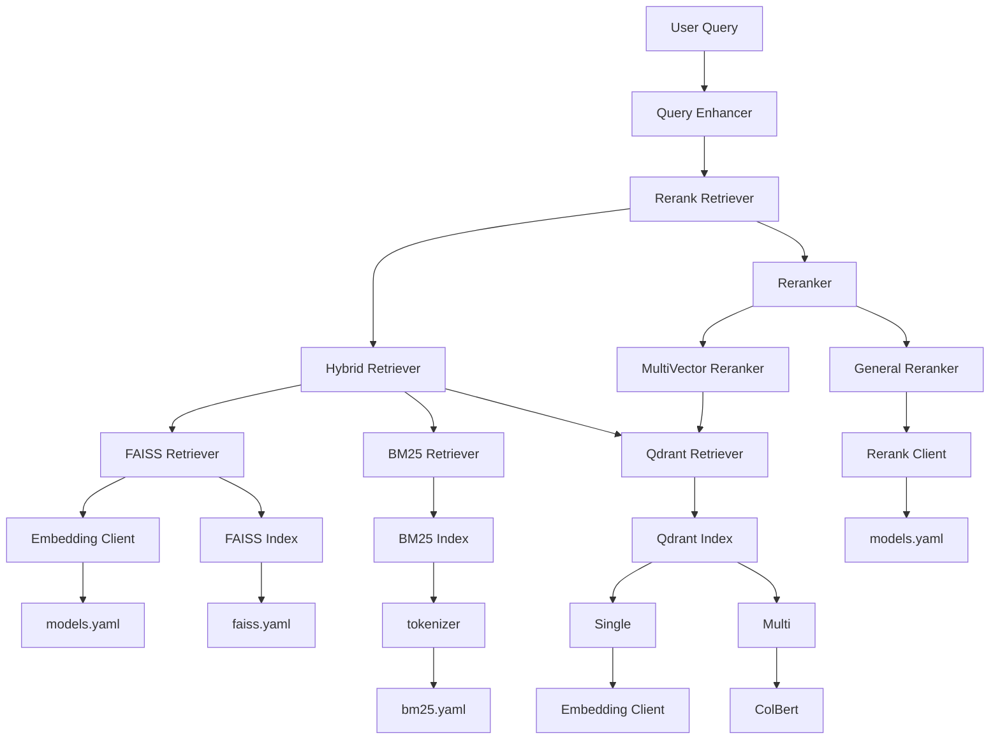

<div align="center" xmlns="http://www.w3.org/1999/html">

[English](README.md) | [中文](README_zh.md)

</div>

Tiny-RAGFlow is a lightweight Retrieval-Augmented Generation (RAG) framework designed for quickly building efficient vector retrieval systems. This project does not rely on external databases and supports multiple mainstream retrieval backends, including `faiss`, `bm25`, and `qdrant`, offering both single-vector and multi-vector hybrid retrieval capabilities. Whether handling single queries or complex multi-intent analysis, Tiny-RAGFlow efficiently completes tasks through its flexible configuration and reranker modules. Its modular architecture allows developers to freely combine retrieval strategies and models based on their needs, catering to a wide range of application scenarios.

## Architecture


### Features and Supported Formats

| Feature | Supported Items |
| :--- | :--- |
| **Index Backends** | `faiss` (Local dense vector retrieval)<br>`bm25` (Keyword-based sparse retrieval)<br>`qdrant` (Vector database, supports single & multi-vector) |
| **Retrieval Modes** | Single-Vector Retrieval<br>Multi-Vector Retrieval (ColBERT)<br>Hybrid Retrieval (RRF) |
| **Data & Config** | **Dataset**: `JSON` (with `id` and `text` fields)<br>**Configuration**: `YAML` |
| **Reranker Models** | `bge-reranker-base`<br>`JinaReranker` |

## Project Structure

This project uses a modular structure to separate core logic, configurations, scripts, and data for easier maintenance and extension.

```
Tiny-RAGFlow/
├── src/                      # Core source code
│   ├── core/                 # Core components (index, clients, etc.)
│   ├── retrievers/           # Retriever modules (faiss, bm25, qdrant, hybrid)
│   ├── rerankers/            # Reranker modules
│   ├── pipelines/            # Data processing and retrieval pipelines
│   ├── evaluation/           # Evaluation module
│   └── utils/                # Utility functions
├── config/                   # Configuration files
│   ├── models.yaml           # Model configurations
│   ├── faiss.yaml            # Faiss-related settings
│   ├── bm25.yaml             # BM25-related settings
│   └── qdrant.yaml           # Qdrant-related settings
├── scripts/                  # Utility scripts
│   ├── create_*.py           # Scripts to create various indexes
│   ├── search_*.py           # Scripts to perform searches
│   └── update_*.py           # Scripts to update indexes
├── data/                     # Data directory
│   ├── dataset.json          # Sample dataset
│   └── *.faiss, *.pkl        # Generated index files
├── test/                     # Test cases
└── README.md                 # English documentation
└── README_zh.md              # Chinese documentation
```

-   **`src/`**: Contains all core Python source code. `retrievers` and `rerankers` are the heart of this project, implementing various retrieval and reranking strategies.
-   **`config/`**: Stores all configuration files. You can modify these `YAML` files to adjust the behavior of different modules, such as switching models or tuning index parameters.
-   **`scripts/`**: Provides a set of command-line tools for you to quickly create, search, and update indexes without writing extra code.
-   **`data/`**: Used to store your raw datasets and the index files generated by the `scripts`.
-   **`test/`**: Includes unit and integration tests for various modules to ensure code stability.

## Installation

### Installation Guide

Follow these steps to install and set up the development environment for `Tiny-RAGFlow`.

**1. Clone the Project**

First, clone the project to your local machine using `git`:

```bash
git clone https://github.com/your-username/Tiny-RAGFlow.git
cd Tiny-RAGFlow
```

**2. Create a Virtual Environment (Recommended)**

To avoid package version conflicts, it is recommended to create a Python virtual environment in the project directory:

```bash
# Create a virtual environment
python -m venv .venv

# Activate the virtual environment
# On Windows
# .\.venv\Scripts\activate
# On macOS and Linux
source .venv/bin/activate
```

**3. Install Dependencies**

In the activated virtual environment, use `pip` to install all required dependencies. This command reads the settings from `pyproject.toml` and handles dependencies automatically:

```bash
pip install .
```

After installation is complete, you can start using the scripts in `scripts/` or running the code in `src/`.

## Quick Start

This guide will walk you through a complete RAG workflow, from creating an index to performing a query, getting you up and running with Tiny-RAGFlow in minutes.

#### Step 1: Prepare Your Data

First, you need a dataset. The project accepts `JSON` format, where each object must contain at least an `id` and a `text` field.

Create a file named `dataset.json` in the `data/` directory (or use/modify the existing one) with the following content:

**`data/dataset.json`**
```json
[
    { "id": 1, "text": "Tiny-RAGFlow is a lightweight RAG framework." },
    { "id": 2, "text": "It supports multiple retrieval backends like faiss, bm25, and qdrant." },
    { "id": 3, "text": "Users can optimize search results ranking with a reranker." }
]
```

#### Step 2: Create a FAISS Index

Let's start with the most basic `FAISS` vector retrieval. FAISS is suitable for fast semantic similarity searches.

1.  **Check Configuration Files**:
    *   `config/faiss.yaml`: Verify the path where the index will be saved.
    *   `config/models.yaml`: Confirm the `embedding_model` to be used (e.g., `m3e-base`).

2.  **Run the Index Creation Script**:
    Open your terminal and run the following command to convert the content of `data/dataset.json` into a vector index.

    ```bash
    python scripts/create_faiss_index.py
    ```
    > The script uses default config paths. If your files are in different locations, you can specify them using arguments like `--faiss_config`, `--model_config_path`, etc.

    After successful execution, you will see `faiss_index.faiss` and `faiss_metadata.pkl` in the `data/` directory.

#### Step 3: Perform Your First Retrieval

With the index created, let's ask a question!

1.  **Create a Query Script**:
    Create a file named `quick_search.py` and paste the following code. This script will load the FAISS index you just created and perform a query.

    **`quick_search.py`**
    ```python
    import asyncio
    from src.retrievers.faiss_retriever import FaissRetriever

    async def main():
        # 1. Load the FaissRetriever
        retriever = FaissRetriever.from_config({
            "index_config": "./config/faiss.yaml",
            "embedding_model": "m3e-base",
            "model_config_path": "./config/models.yaml",
            "top_k": 2
        })

        # 2. Define your question
        query = "How to improve search ranking?"
        print(f"Query: {query}\n")

        # 3. Perform retrieval
        results = await retriever.retrieve(query)

        # 4. Display results
        print("==== Retrieval Results ====")
        for item in results:
            score = item["score"]
            text = item["metadata"].get("text")
            print(f"Score: {score:.4f} -> Content: {text}")

    if __name__ == "__main__":
        asyncio.run(main())
    ```

2.  **Run the Script**:
    ```bash
    python quick_search.py
    ```

    You should see an output similar to this, where the system has found the most relevant documents based on semantic similarity:

    ```
    Query: How to improve search ranking?

    ==== Retrieval Results ====
    Score: 0.6321 -> Content: Users can optimize search results ranking with a reranker.
    Score: 0.4875 -> Content: Tiny-RAGFlow is a lightweight RAG framework.
    ```

Congratulations! You have successfully completed your first RAG retrieval workflow.

### Advanced Usage: Trying Different Retrieval Strategies

Now that you've mastered basic `FAISS` retrieval, let's explore more powerful features of `Tiny-RAGFlow`: `BM25` keyword retrieval and `Hybrid` retrieval.

#### 1. Keyword Retrieval with BM25

`BM25` is a keyword-based algorithm, ideal for scenarios requiring exact word matching.

**a. Create a BM25 Index**

Similar to FAISS, we first need to create a `BM25` index for our data.

```bash
python scripts/create_bm25_index.py
```

After execution, a `bm25_index.pkl` file will appear in the `data/` directory.

**b. Use `BM25Retriever`**

Now, modify `quick_search.py` to replace `FaissRetriever` with `BM25Retriever`.

```python
# quick_search.py

import asyncio
from src.retrievers.bm25_retriever import BM25Retriever # Import BM25Retriever

async def main():
    # 1. Load the BM25Retriever
    retriever = BM25Retriever.from_config({
        "index_config": "./config/bm25.yaml",
        "top_k": 2
    })

    # ... (The rest of the code is the same as the FAISS example) ...
```

Run `python quick_search.py` again, and you will see that the results are now based on keyword matching.

#### 2. Combining Strengths: Hybrid Retrieval

`HybridRetriever` combines the results from multiple retrievers (like `FAISS` and `BM25`), leveraging both semantic similarity and keyword matching to significantly improve retrieval quality.

Modify `quick_search.py` to use `HybridRetriever`:

```python
# quick_search.py

import asyncio
from src.retrievers.hybrid_retriever import HybridRetriever # Import HybridRetriever

async def main():
    # 1. Define the hybrid retrieval configuration
    hybrid_config = {
        "retrievers": [
            {
                "type": "faiss",
                "config": {
                    "index_config": "./config/faiss.yaml",
                    "embedding_model": "m3e-base",
                    "model_config_path": "./config/models.yaml",
                    "top_k": 2
                }
            },
            {
                "type": "bm25",
                "config": {
                    "index_config": "./config/bm25.yaml",
                    "top_k": 2
                }
            }
        ],
        "fusion_method": "rrf", # Use RRF algorithm to fuse results
        "top_k": 2
    }

    # 2. Load the HybridRetriever
    retriever = HybridRetriever.from_config(hybrid_config)

    # ... (The rest of the code is the same) ...
```

Your retrieval workflow now has the power of two different retrieval strategies!

### Expert Usage: Optimizing Results with a Reranker

When retrieval returns many results, a `Reranker` can re-sort these initial results to bring the most relevant ones to the top.

`RerankRetriever` can easily wrap any existing retriever (including `HybridRetriever`).

Let's add a `Reranker` on top of our `HybridRetriever`:

```python
# quick_search.py

import asyncio
from src.retrievers.rerank_retriever import RerankRetriever # Import RerankRetriever

async def main():
    # 1. Define the RerankRetriever configuration
    rerank_config = {
        "retriever": {
            "type": "hybrid", # Use the previous HybridRetriever as the base retriever
            "config": {
                "retrievers": [
                    {
                        "type": "faiss",
                        "config": {
                            "index_config": "./config/faiss.yaml",
                            "embedding_model": "m3e-base",
                            "model_config_path": "./config/models.yaml",
                            "top_k": 5 # Retrieve more results for the Reranker to sort
                        }
                    },
                    {
                        "type": "bm25",
                        "config": {
                            "index_config": "./config/bm25.yaml",
                            "top_k": 5
                        }
                    }
                ],
                "fusion_method": "rrf",
                "top_k": 5
            }
        },
        "reranker": {
            "type": "general_reranker", # Use a general-purpose reranker
            "config": {
                "model_name": "bge-reranker-base",
                "config_path": "./config/models.yaml"
            }
        },
        "top_k": 2 # After reranking, take the final top 2 results
    }

    # 2. Load the RerankRetriever
    retriever = RerankRetriever.from_config(rerank_config)

    # ... (The rest of the code is the same) ...
```

Run `quick_search.py`, and you will get the final results, finely sorted by the `Reranker`.

You have now mastered the core usage of `Tiny-RAGFlow` from basic to expert levels. Feel free to combine different retrievers and rerankers to tackle various complex application scenarios.

### Model Configuration and Local Deployment (models.yaml)

One of the core design principles of `Tiny-RAGFlow` is flexibility. You can easily connect to your own deployed or hosted model services (Embedding or Reranker). All model connection information is managed centrally in the `config/models.yaml` file.

#### Configuration Structure

The structure of `config/models.yaml` is as follows. You can create multiple profiles for different model services:

```yaml
# config/models.yaml

# Example: Using an OpenAI-compatible API
m3e-base:
  model_name: "m3e-base"
  api_base: "http://localhost:8000/v1"
  api_key: "your-api-key" # If your service requires a key

bge-reranker-base:
  model_name: "bge-reranker-base"
  api_base: "http://localhost:8001/v1"
  api_key: "your-api-key"

# Example: Connecting to Jina AI's service
jina-reranker-v1-turbo-en:
  model_name: "jina-reranker-v1-turbo-en"
  api_key: "your-jina-api-key" # Jina Reranker requires an API key
  api_base: "https://api.jina.ai/v1/rerank"
```

#### How to Connect a Custom Model Service

If your Embedding or Reranker model is deployed in a way that is compatible with the OpenAI SDK (e.g., using `FastAPI`, `vLLM`, or `LiteLLM`), you just need to provide the service endpoint in `models.yaml`.

**Steps:**

1.  **Download and Deploy the Model**:
    Users need to download the required model from a model hub (like Hugging Face) and deploy it as a web service. This service must provide an endpoint compatible with the OpenAI API `v1/embeddings` or `v1/rerank`.

2.  **Configure `models.yaml`**:
    Add a new configuration block in `config/models.yaml` and fill in these two key fields:
    *   `model_name`: The internal name you give this model. It must match the model name specified when you deployed the service.
    *   `api_base`: The API endpoint URL of your model service (e.g., `http://localhost:8000/v1`).

3.  **Reference it in a Retriever/Reranker**:
    In the configuration of your `Retriever` or `Reranker`, reference the name you defined in `models.yaml` using the `embedding_model` or `model_name` field.

    ```python
    # Example: Using a custom m3e-base model in FaissRetriever
    retriever = FaissRetriever.from_config({
        "index_config": "./config/faiss.yaml",
        "embedding_model": "m3e-base", # This name corresponds to models.yaml
        "model_config_path": "./config/models.yaml",
        "top_k": 2
    })
    ```

This approach allows `Tiny-RAGFlow` to seamlessly integrate with your existing model infrastructure without modifying any core code.

## License
This project is licensed under the MIT License.