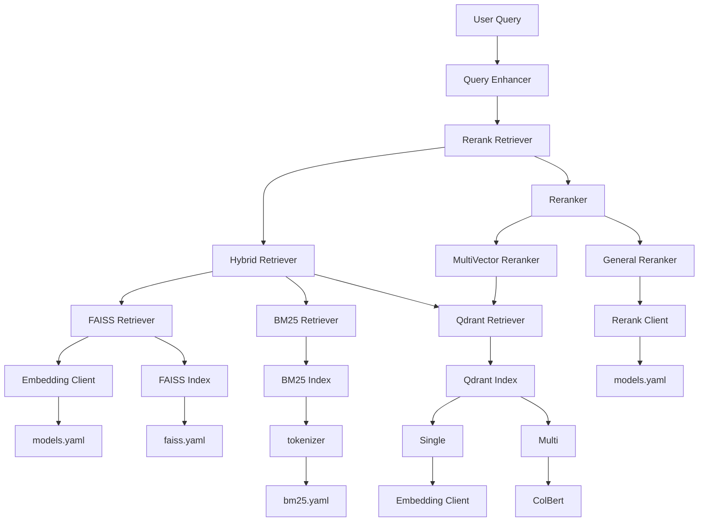

Tiny-RAGFlow 是一個輕量級的檢索增強生成（RAG）框架，專為快速搭建高效的向量檢索系統而設計。此專案無需依賴外部資料庫，並支援多種主流的檢索後端，包括 `faiss`、`bm25` 和 `qdrant`，提供單向量與多向量的混合檢索能力。無論是處理單一查詢還是進行複雜的多意圖分析，Tiny-RAGFlow 都能透過其靈活的配置和 reranker 模組高效完成任務。其模組化的架構允許開發者根據需求自由組合檢索策略與模型，適用於多樣化的應用場景。

## 架構


### 主要功能與支援格式

| 功能 (Feature) | 支援項目 (Supported Items) |
| :--- | :--- |
| **索引後端** | `faiss` (本機密集向量檢索)<br>`bm25` (關鍵字稀疏檢索)<br>`qdrant` (向量資料庫，支援單向量與多向量) |
| **檢索模式** | 單向量檢索<br>多向量檢索 (ColBERT)<br>混合檢索 (RRF) |
| **資料與設定** | **資料集**: `JSON` (包含 `id` 與 `text` 欄位)<br>**設定檔**: `YAML` |
| **重排模型** | `bge-reranker-base`<br>`JinaReranker` |

## 專案結構

本專案採用模組化的結構，將核心邏輯、設定、腳本和資料分離，以便於維護和擴展。

```
Tiny-RAGFlow/
├── src/                      # 核心原始碼
│   ├── core/                 # 核心元件，如索引、客戶端等
│   ├── retrievers/           # 檢索器模組 (faiss, bm25, qdrant, hybrid)
│   ├── rerankers/            # 重排器模組
│   ├── pipelines/            # 資料處理和檢索流程
│   ├── evaluation/           # 評估模組
│   └── utils/                # 工具函式
├── config/                   # 設定檔目錄
│   ├── models.yaml           # 模型設定
│   ├── faiss.yaml            # Faiss 相關設定
│   ├── bm25.yaml             # BM25 相關設定
│   └── qdrant.yaml           # Qdrant 相關設定
├── scripts/                  # 實用腳本
│   ├── create_*.py           # 建立各類索引的腳本
│   ├── search_*.py           # 執行搜尋的腳本
│   └── update_*.py           # 更新索引的腳本
├── data/                     # 資料目錄
│   ├── dataset.json          # 範例資料集
│   └── *.faiss, *.pkl        # 生成的索引檔案
├── test/                     # 測試案例
└── README.md                 # 英文版說明文件
└── README_zh.md              # 中文版說明文件
```

-   **`src/`**: 包含所有核心功能的 Python 原始碼。`retrievers` 和 `rerankers` 是本專案的核心，實現了不同的檢索和重排策略。
-   **`config/`**: 存放所有設定檔。您可以透過修改這些 `YAML` 檔案來調整不同模組的行為，例如切換模型、調整索引參數等。
-   **`scripts/`**: 提供了一系列命令列工具，方便您快速建立索引、執行搜尋和更新索引，無需撰寫額外程式碼。
-   **`data/`**: 用於存放您的原始資料集以及由 `scripts` 生成的索引檔案。
-   **`test/`**: 包含了對各個模組的單元測試和整合測試，確保程式碼的穩定性。

## 安裝

### 安裝指南

請依照以下步驟來安裝並設定 `Tiny-RAGFlow` 的開發環境。

**1. 複製專案**

首先，使用 `git` 將專案複製到您的本機：

```bash
git clone https://github.com/your-username/Tiny-RAGFlow.git
cd Tiny-RAGFlow
```

**2. 建立虛擬環境 (建議)**

為了避免套件版本衝突，建議您在專案目錄下建立一個 Python 虛擬環境：

```bash
# 建立虛擬環境
python -m venv .venv

# 啟用虛擬環境
# On Windows
# .\.venv\Scripts\activate
# On macOS and Linux
source .venv/bin/activate
```

**3. 安裝相依套件**

在虛擬環境中，使用 `pip` 安裝專案所需的所有相依套件。此命令會讀取 `pyproject.toml` 的設定並自動處理相依性：

```bash
pip install .
```

安裝完成後，您就可以開始使用 `scripts/` 中的腳本或執行 `src/` 中的程式碼了。

### 快速開始 (Quick Start)

本指南將帶您完成一個完整的 RAG 流程，從建立索引到執行查詢，讓您在幾分鐘內上手 Tiny-RAGFlow。

#### 步驟 1：準備您的資料

首先，您需要一個資料集。專案接受 `JSON` 格式，其中每個物件至少包含 `id` 和 `text` 欄位。

請在 `data/` 目錄下建立一個名為 `dataset.json` 的檔案（如果已存在，可直接使用或修改），內容如下：

**`data/dataset.json`**
```json
[
    { "id": 1, "text": "Tiny-RAGFlow 是一個輕量級的 RAG 框架。" },
    { "id": 2, "text": "它支援 faiss、bm25 和 qdrant 等多種檢索後端。" },
    { "id": 3, "text": "使用者可以透過 reranker 來優化檢索結果的排序。" }
]
```

#### 步驟 2：建立 FAISS 索引

我們從最基礎的 `FAISS` 向量檢索開始。FAISS 適合進行快速的語意相似度搜尋。

1.  **檢查設定檔**：
    *   `config/faiss.yaml`: 確認索引儲存的路徑。
    *   `config/models.yaml`: 確認要使用的 `embedding_model` (例如 `m3e-base`)。

2.  **執行建立索引腳本**：
    打開終端機，執行以下命令，將 `data/dataset.json` 的內容轉換為向量索引。

    ```bash
    python scripts/create_faiss_index.py
    ```
    > 腳本會使用預設的設定檔路徑。如果您的設定檔在不同位置，可以使用 `--faiss_config`、`--model_config_path` 等參數指定。

    執行成功後，您會在 `data/` 目錄下看到 `faiss_index.faiss` 和 `faiss_metadata.pkl` 兩個檔案。

#### 步驟 3：執行您的第一次檢索

索引建立好了，現在讓我們來問一個問題！

1.  **建立查詢腳本**：
    建立一個名為 `quick_search.py` 的檔案，並貼上以下程式碼。這段程式碼會載入剛剛建立的 FAISS 索引，並對其進行查詢。

    **`quick_search.py`**
    ```python
    import asyncio
    from src.retrievers.faiss_retriever import FaissRetriever

    async def main():
        # 1. 載入 FaissRetriever
        retriever = FaissRetriever.from_config({
            "index_config": "./config/faiss.yaml",
            "embedding_model": "m3e-base",
            "model_config_path": "./config/models.yaml",
            "top_k": 2
        })

        # 2. 定義您的問題
        query = "如何提升搜尋排序？"
        print(f"查詢: {query}\n")

        # 3. 執行檢索
        results = await retriever.retrieve(query)

        # 4. 顯示結果
        print("==== 檢索結果 ====")
        for item in results:
            score = item["score"]
            text = item["metadata"].get("text")
            print(f"分數: {score:.4f} -> 內容: {text}")

    if __name__ == "__main__":
        asyncio.run(main())
    ```

2.  **執行腳本**：
    ```bash
    python quick_search.py
    ```

    您應該會看到類似以下的輸出，系統根據語意相似度找到了最相關的文件：

    ```
    查詢: 如何提升搜尋排序？

    ==== 檢索結果 ====
    分數: 0.6321 -> 內容: 使用者可以透過 reranker 來優化檢索結果的排序。
    分數: 0.4875 -> 內容: Tiny-RAGFlow 是一個輕量級的 RAG 框架。
    ```

恭喜！您已經成功完成了第一次的 RAG 檢索流程。

### 進階篇：嘗試不同的檢索策略

學會了基礎的 `FAISS` 檢索後，讓我們來探索 `Tiny-RAGFlow` 更強大的功能：`BM25` 關鍵字檢索與 `Hybrid` 混合檢索。

#### 1. 使用 BM25 進行關鍵字檢索

`BM25` 是一種基於關鍵字匹配的演算法，它非常適合處理需要精確詞語匹配的場景。

**a. 建立 BM25 索引**

與 FAISS 類似，我們需要先為資料建立 `BM25` 索引。

```bash
python scripts/create_bm25_index.py
```

執行後，`data/` 目錄下會出現 `bm25_index.pkl` 檔案。

**b. 使用 `BM25Retriever`**

現在，修改 `quick_search.py`，將 `FaissRetriever` 換成 `BM25Retriever`。

```python
# quick_search.py

import asyncio
from src.retrievers.bm25_retriever import BM25Retriever # 引用 BM25Retriever

async def main():
    # 1. 載入 BM25Retriever
    retriever = BM25Retriever.from_config({
        "index_config": "./config/bm25.yaml",
        "top_k": 2
    })

    # ... (其餘程式碼與 FAISS 範例相同) ...
```

再次執行 `python quick_search.py`，您會發現這次的結果是基於關鍵字匹配的。

#### 2. 結合兩者優勢：混合檢索 (Hybrid Retrieval)

`HybridRetriever` 可以將多個檢索器（如 `FAISS` 和 `BM25`）的結果結合起來，同時利用語意相似度和關鍵字匹配的優點，大幅提升檢索品質。

修改 `quick_search.py` 以使用 `HybridRetriever`：

```python
# quick_search.py

import asyncio
from src.retrievers.hybrid_retriever import HybridRetriever # 引用 HybridRetriever

async def main():
    # 1. 定義混合檢索的設定
    hybrid_config = {
        "retrievers": [
            {
                "type": "faiss",
                "config": {
                    "index_config": "./config/faiss.yaml",
                    "embedding_model": "m3e-base",
                    "model_config_path": "./config/models.yaml",
                    "top_k": 2
                }
            },
            {
                "type": "bm25",
                "config": {
                    "index_config": "./config/bm25.yaml",
                    "top_k": 2
                }
            }
        ],
        "fusion_method": "rrf", # 使用 RRF 演算法融合結果
        "top_k": 2
    }

    # 2. 載入 HybridRetriever
    retriever = HybridRetriever.from_config(hybrid_config)

    # ... (其餘程式碼與之前相同) ...
```

現在，您的檢索流程已經同時具備了兩種檢索策略的能力！

### 高級篇：使用 Reranker 優化結果

當檢索回來的結果很多時，`Reranker` 可以對這些初步結果進行二次排序，將最相關的內容排在最前面。

`RerankRetriever` 可以輕鬆地包裝任何現有的檢索器（包括 `HybridRetriever`）。

讓我們在 `HybridRetriever` 的基礎上加入 `Reranker`：

```python
# quick_search.py

import asyncio
from src.retrievers.rerank_retriever import RerankRetriever # 引用 RerankRetriever

async def main():
    # 1. 定義 RerankRetriever 的設定
    rerank_config = {
        "retriever": {
            "type": "hybrid", # 將之前的 HybridRetriever 作為底層檢索器
            "config": {
                "retrievers": [
                    {
                        "type": "faiss",
                        "config": {
                            "index_config": "./config/faiss.yaml",
                            "embedding_model": "m3e-base",
                            "model_config_path": "./config/models.yaml",
                            "top_k": 5 # 召回更多結果給 Reranker 排序
                        }
                    },
                    {
                        "type": "bm25",
                        "config": {
                            "index_config": "./config/bm25.yaml",
                            "top_k": 5
                        }
                    }
                ],
                "fusion_method": "rrf",
                "top_k": 5
            }
        },
        "reranker": {
            "type": "general_reranker", # 使用通用的 Reranker
            "config": {
                "model_name": "bge-reranker-base",
                "config_path": "./config/models.yaml"
            }
        },
        "top_k": 2 # Reranker 排序後，最終取前 2 名
    }

    # 2. 載入 RerankRetriever
    retriever = RerankRetriever.from_config(rerank_config)

    # ... (其餘程式碼與之前相同) ...
```

執行 `quick_search.py`，您將得到經過 `Reranker` 精細排序後的最終結果。

至此，您已經掌握了 `Tiny-RAGFlow` 從基礎到進階的核心用法。您可以自由組合不同的檢索器與重排器，以應對各種複雜的應用場景。

### 模型設定與本地部署 (models.yaml)

`Tiny-RAGFlow` 的核心設計理念之一是彈性，您可以輕鬆連接到自己部署或託管的模型服務 (Embedding 或 Reranker)。所有模型的連接資訊都統一在 `config/models.yaml` 檔案中進行管理。

#### 設定檔結構

`config/models.yaml` 的結構如下，您可以為不同的模型服務建立多個設定檔：

```yaml
# config/models.yaml

# 範例：使用 OpenAI 相容的 API
m3e-base:
  model_name: "m3e-base"
  api_base: "http://localhost:8000/v1"
  api_key: "your-api-key" # 如果您的服務需要金鑰

bge-reranker-base:
  model_name: "bge-reranker-base"
  api_base: "http://localhost:8001/v1"
  api_key: "your-api-key"

# 範例：連接到 Jina AI 的服務
jina-reranker-v1-turbo-en:
  model_name: "jina-reranker-v1-turbo-en"
  api_key: "your-jina-api-key" # Jina Reranker 需要金鑰
  api_base: "https://api.jina.ai/v1/rerank"
```

#### 如何連接自訂模型服務

如果您的 Embedding 或 Reranker 模型是透過相容 OpenAI SDK 的方式部署的（例如使用 `FastAPI`、`vLLM` 或 `LiteLLM`），您只需要在 `models.yaml` 中提供服務的端點即可。

**操作步驟：**

1.  **下載並部署模型**：
    使用者需自行從模型庫（如 Hugging Face）下載所需的模型，並將其部署為一個 Web 服務。該服務需要提供一個與 OpenAI API `v1/embeddings` 或 `v1/rerank` 相容的端點。

2.  **設定 `models.yaml`**：
    在 `config/models.yaml` 中新增一個設定區塊，並填寫以下兩個關鍵欄位：
    *   `model_name`: 您為此模型取的內部名稱，需要與您部署服務時指定的模型名稱一致。
    *   `api_base`: 您的模型服務的 API 端點 URL (例如 `http://localhost:8000/v1`)。

3.  **在檢索器中引用**：
    在 `Retriever` 或 `Reranker` 的設定中，透過 `embedding_model` 或 `model_name` 欄位引用您在 `models.yaml` 中定義的名稱。

    ```python
    # 範例：在 FaissRetriever 中使用自訂的 m3e-base 模型
    retriever = FaissRetriever.from_config({
        "index_config": "./config/faiss.yaml",
        "embedding_model": "m3e-base", # 這裡的名稱對應到 models.yaml
        "model_config_path": "./config/models.yaml",
        "top_k": 2
    })
    ```

透過這種方式，`Tiny-RAGFlow` 可以無縫地與您現有的模型基礎設施整合，而無需修改任何核心程式碼。

## License
This project is licensed under the MIT License.